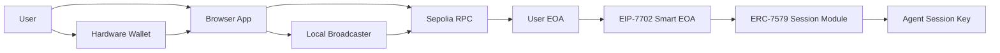

# MVP Architecture

## Goal

Build a Sepolia POC where a hardware-wallet-controlled EOA becomes a smart EOA through EIP-7702, then manages agent session keys through an ERC-7579-compatible modular smart account.

The first version proves management:

1. Delegate the EOA.
2. Initialize the smart account.
3. Install or configure session-key support.
4. Generate agent keys.
5. Attach permissions.
6. Revoke keys.

Agent-side transaction execution can be added after the management flow is reliable.

## Architecture



## Components

Browser app:
The main user interface. It connects to the hardware wallet, requests EIP-7702 authorization signatures, generates session keys, builds permission configuration, and displays active keys.

Hardware wallet:
The root signer. It signs the EIP-7702 authorization and later signs high-authority account management actions such as module installation, session creation, or revocation.

Local broadcaster:
A funded Sepolia key used only to submit transactions and pay gas. It does not control the user's account.

Smart EOA implementation:
The contract code delegated to the EOA via EIP-7702. For MVP, start with an implementation compatible with ERC-7579 modules and EIP-7702 smart EOAs.

Session module:
The validator/policy system that verifies agent session-key signatures and enforces permissions.

RPC provider:
Sepolia JSON-RPC endpoint used for chain ID, nonces, broadcasting, receipts, account code, and module state reads.

## EIP-7702 Delegation Flow

1. User enters Sepolia RPC URL and target smart account implementation.
2. App fetches `eth_chainId` and the EOA pending nonce.
3. Hardware wallet signs:

```text
keccak256(0x05 || rlp([chain_id, smart_account_implementation, nonce]))
```

4. Browser verifies the recovered signer equals the connected hardware wallet account.
5. Local broadcaster submits a type-4 transaction with `authorizationList`.
6. App verifies the EOA code is the expected EIP-7702 delegation marker.

## Session Key Management Flow

1. User clicks `Create Agent Key`.
2. Browser generates a fresh secp256k1 private key locally.
3. Browser derives the public agent address.
4. User configures permissions:

- Name and description.
- Expiration.
- Token spending limits.
- Native ETH spending limits.
- Contract allowlist.
- Function selectors.
- Start and end timestamps.

5. App builds the session policy payload.
6. Hardware wallet approves the management action.
7. App submits the session creation transaction.
8. Private key is shown once with a copy action and a warning.
9. UI lists the session key by public address, permissions, status, and revoke action.

## Candidate Session Stack

Use Rhinestone Smart Sessions first.

Reasons:

- It is designed for ERC-7579 modular accounts.
- It supports scoped session keys.
- It supports policies such as action restrictions and spending limits.
- Current Rhinestone docs describe EIP-7702 smart EOA support.

Do not build a custom module until we confirm a missing requirement.

## Permission Presets

The UI should support broad use cases without exposing low-level policy internals first.

Suggested presets:

- Stablecoin allowance.
- DeFi protocol-only access.
- Single contract automation.
- Claim/rewards-only access.
- NFT mint-only access.
- Game/app action key.
- Time-limited emergency operator.
- Read/write app key with no token transfers.

Advanced mode can expose raw contract allowlists, function selectors, ERC20 value limits, native ETH value limits, token addresses, and time windows.

## Security Model

The hardware wallet is the root authority:
It can delegate, install modules, create sessions, update sessions, and revoke sessions.

The agent key is constrained:
It can only execute actions accepted by the session module and policies.

The local broadcaster is not trusted with account authority:
It only pays gas and submits signed payloads.

The browser is sensitive:
Generated private keys appear in the browser. The MVP should never send generated session private keys to a backend.

The private key is shown once:
If the user loses it, they should revoke the session and create a new key.

## Data Model

Session key:

```ts
type SessionKey = {
  id: string;
  name: string;
  publicAddress: `0x${string}`;
  status: "active" | "expired" | "revoked";
  createdAt: string;
  expiresAt?: string;
  permissions: Permission[];
};
```

Permission:

```ts
type Permission =
  | {
      type: "erc20-spend-limit";
      token: `0x${string}`;
      amount: string;
    }
  | {
      type: "contract-allowlist";
      contract: `0x${string}`;
      selectors?: `0x${string}`[];
    }
  | {
      type: "native-spend-limit";
      amountWei: string;
    }
  | {
      type: "time-window";
      validAfter: number;
      validUntil: number;
    };
```

## MVP Milestones

Milestone 1: Delegation POC

- Hardware wallet connects.
- EIP-7702 authorization signs.
- Sepolia broadcast succeeds.
- Delegation is verified.

Milestone 2: Smart account initialization

- Choose compatible smart EOA implementation.
- Initialize account ownership with the hardware wallet EOA.
- Confirm management calls can be executed.

Milestone 3: Session module

- Install or configure Smart Sessions.
- Create one session key with a simple contract allowlist.
- Revoke the session key.

Milestone 4: Permission UI

- Generate browser key.
- Show private key once.
- Add presets for ERC20 spending, native ETH spending, contract allowlists, function selectors, and time windows.
- Display active/revoked/expired keys.

Milestone 5: Agent demo

- Add a small agent client later.
- The agent receives the generated key.
- The agent succeeds inside policy and fails outside policy.

## Open Technical Questions

- Which exact ERC-7579 account implementation should be delegated to first on Sepolia?
- Which Rhinestone SDK path is best for smart EOAs with EIP-7702 in a browser-only POC?
- Which permission policies are already available off the shelf, and which need custom policy contracts?
- Can all management actions be submitted as normal EIP-7702 transactions, or should we use ERC-4337 UserOperations for session management?
- How should session metadata be stored: local browser storage, indexed chain events, or a small backend?

## References

- [EIP-7702](https://eips.ethereum.org/EIPS/eip-7702)
- [ERC-7579](https://erc7579.com/)
- [Rhinestone Smart Sessions](https://docs.rhinestone.dev/smart-wallet/smart-sessions/overview)
- [Rhinestone EIP-7702](https://docs.rhinestone.dev/smart-wallet/core/eip-7702)
